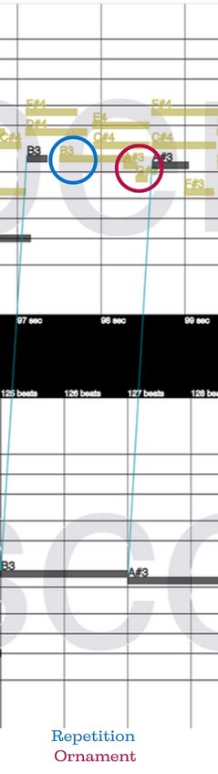

# Supplementary Materials for: Challenges in Basso Continuo Performance-to-Score Alignment

## Abstract
Basso continuo is a Baroque practice of creating harmonic improvisations above a given bass line. In addition to its historical heritage, it is also a living improvisation genre performed by most keyboard players in historically informed performance. However, present-day basso continuo performance has remained understudied empirically. One key enabler for such research is an automatic system that aligns basso continuo performances to the written bass line in the score. This, however, presents challenges that are distinct from those of standard performance-to-score alignment tasks, due to the underspecified notation of basso continuo. We analyze the specifics of basso continuo performance-to-score alignment through a dataset of basso continuo performances that we had previously introduced, based on manually annotated performance-to-score alignments of a subset of the pieces. From our analysis, we provide a compilation of challenges specific to basso continuo performance which need to be addressed during the alignment process.

## Examples

<table>
  <tr>
    <td><strong>Ornaments</strong></td>
    <td>
       
      <audio controls>
        <source src="audio/ornaments.mp3" type="audio/mpeg">
        Your browser does not support the audio element.
      </audio>
    </td>
  </tr>
  <tr>
    <td><strong>Repetitions</strong></td>
    <td>
       
      <audio controls>
        <source src="audio/repetitions.mp3" type="audio/mpeg">
        Your browser does not support the audio element.
      </audio>
    </td>
  </tr>
  <tr>
    <td><strong>Skips</strong></td>
    <td>
       
      <audio controls>
        <source src="audio/skips.mp3" type="audio/mpeg">
        Your browser does not support the audio element.
      </audio>
    </td>
  </tr>
  <tr>
    <td><strong>Substitutions</strong></td>
    <td>
       
      <audio controls>
        <source src="audio/substitutions.mp3" type="audio/mpeg">
        Your browser does not support the audio element.
      </audio>
    </td>
  </tr>
</table>